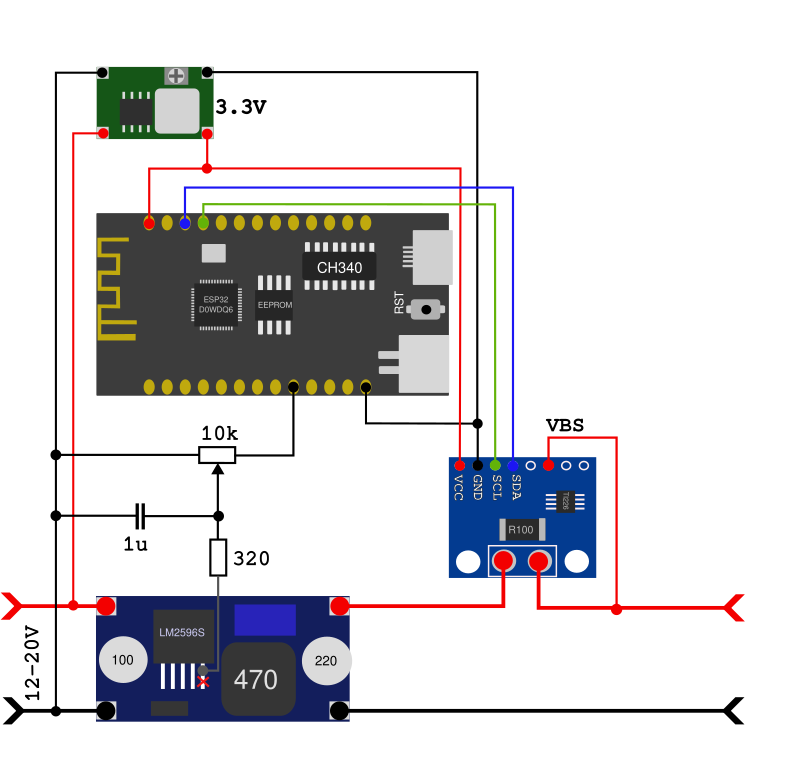

# Esp32AdjPsu

Goal of this project is to build adjustable power supply that is controled by a ESP32 mcu.
Requirements:
- CV/CC modes;
- ability to configure it via web-browser;
- measure Volts, Ampers, Watts, may be capacity.

## Conceptual diagram

